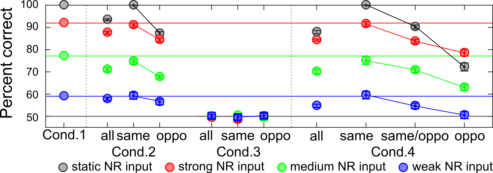

# Invisible Inhibition Model
Computational simulation for invisible retinotopic inhibition on non-retinotopic perception.

Further details are represented in [(Lauffs et al., Cons.&Cog., 2018)](https://doi.org/10.1016/j.concog.2018.03.007)

Also, current simulated results would be presented in [VSS 2018](https://www.visionsciences.org/)

Please cite : 
> Lauffs, M. M., Choung, O. H., Öğmen, H., & Herzog, M. H. (2018). Unconscious retinotopic motion processing affects non-retinotopic motion perception. Consciousness and cognition.

## Simulation details
1. main function
  - simulation 1: discrete input and figure out output performance.
  - simulation 2: gradual input and figure out output performance.
  - simulation 3: train with human behavioral data and fit weight matrices for each participant. 
  
2. Class: Neuron
  - Each node has input, output, delay factor, activation function
  - Currently, ReLu and Linear activation functions are available. 

3. Class: Performance
  - Compute responses and hits/misses of the model performance

## Simulation results
1. **Simulation 1**: discrete input (0-ccw, 1-cw) and figure out output performance

2. **Simulation 2**: gradual input (decimals in btw 0 and 1) and figure out output performance

